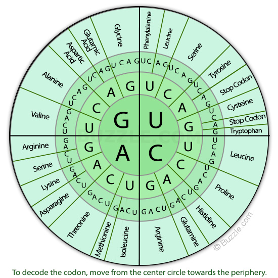
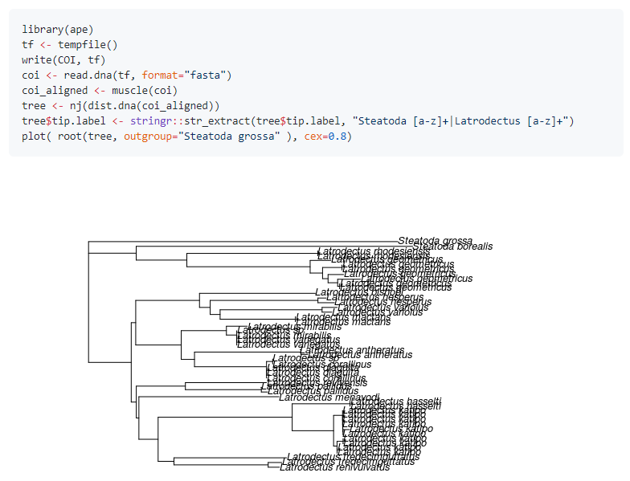

# Working with DNA sequences

서열을 이용한 분석은 Biostrings, IRanges/GenomicRanges 등 몇몇 핵심 패키지들에 기반해서 수행됩니다.

## Biostrings

`Biostrings`는 DNA, RNA, amino acids와 같은 생물학적 string을 다루기 위한 다양한 함수를 제공하는 패키지 입니다. 특히 서열에서의 패턴 탐색이나 Smith-Waterman local alignments, Needleman-Wunsch global alignments 등의 서열 비교함수를 제공하여 간단한 서열 분석에 자주 활용되는 패키지 입니다 [@sippl1999biological]. 아래와 같이 설치할 수 있습니다.

```{r eval=FALSE}
if (!requireNamespace("BiocManager", quietly = TRUE))
    install.packages("BiocManager")

BiocManager::install("Biostrings")
```

```{r, eval=F}
library(Biostrings)
```

Biostrings 패키지는 기본적으로 `XString, XStringSet, XStringViews` 3가지의 class를 정의하고 있습니다. XString은 DNA나 RNA, AA 등 생물학적 서열 한 가닥을 다루기위한 클래스이며 XStringSet은 여러 가닥을 다루기위한 클래스 입니다.


DNAString 함수를 이용해서 객체를 만들어낼 수 있으며 'A', 'C', 'G', 'T' 외에 '-' (insertion), 'N' 을 허용합니다. 

```{r, eval=F}
dna1 <- DNAString("ACGT?")
dna1 <- DNAString("ACGT-N")
dna1[1]
dna1[2:3]

dna2 <- DNAStringSet(c("ACGT", "GTCA", "GCTA"))
dna2[1]
dna2[[1]]
dna2[[1]][1]
```

다음 내장변수 들은 `Biostrings` 패키지를 로드하면 자동으로 저장되는 변수들로 생물학적 서열을 미리 정의해 놓았습니다. IUPAC (International Union of Pure and Applied Chemistry, 국제 순수·응용 화학 연합)

```{r, eval=F}
DNA_BASES
DNA_ALPHABET
IUPAC_CODE_MAP
GENETIC_CODE
```

{width=400}

위 변수들을 이용하면 다음처럼 `sample()` 함수를 이용해서 랜덤하게 DNA 서열을 얻을 수 있습니다. `DNA_BASES`가 4개 길이를 갖는 벡터인데 이 중 10개를 뽑으려면 `replace=T`로 해야 합니다.

```{r, eval=F}
x0 <- sample(DNA_BASES, 10, replace = T)
x0
s1 <- "ATG"
s2 <- "CCC"
s3 <- paste(s1, s2, sep="")
s3
x1 <- paste(x0, collapse="")
x1
```

관련 함수는 [Cheat sheat](http://bioconductor.org/packages/release/bioc/vignettes/Biostrings/inst/doc/BiostringsQuickOverview.pdf) 참고

### DNAString

`DNAString` class에서 `length` 함수는 핵산의 갯수를 (`DNAStringSet` 타입의 변수에서 length는 DNA 가닥의 갯수) 계산하며 핵산의 갯수는 `nchar`함수로 얻어낼 수 있습니다. `toString`은 DNAString 타입을 단순 문자열로 변환해주는 함수이며 상보서열, 역상보서열 등의 정보도 `complement`, `reverseComplement` 등을 사용하여 찾아낼 수 있습니다.

```{r eval=FALSE}
x0 <- paste(sample(DNA_BASES, 10, replace = T), collapse="")
x1 <- DNAString(x0)
class(x0)
class(x1)
length(x1)
toString(x1)
complement(x1)
Biostrings::complement(x1)
reverseComplement(x1)

```

`DNAString`의 인덱싱은 vector (string)과 같으며 DNAStringSet은 list의 인덱싱과 같습니다.

```{r, eval=FALSE}
## indexing
x1[1]
x1[1:3]
subseq(x1, start=3, end=5)
subseq(x1, 3, 5)

## letter frequency
alphabetFrequency(x1, baseOnly=TRUE, as.prob=TRUE)
letterFrequency(x1, c("G", "C"), as.prob=TRUE)

```

### DNAStringSet

`DNAStringSet` class는 여러개의 `DNAString` 을 모아 놓은 집합이라고 보면 됩니다. `length` 함수는 DNA string의 갯수이며 `width` 또는 `nchar` 함수로 각 string의 길이를 구할 수 있으며 이 외 대부분의 `DNAString` 에서 사용되는 함수가 동일하게 사용될 수 있습니다.

```{r eval=FALSE}

x0 <- c("CTC-NACCAGTAT", "TTGA", "TACCTAGAG")
x1 <- DNAStringSet(x0)
class(x0)
class(x1)
names(x1)
names(x1) <- c("A", "B", "C")
length(x1)
width(x1)
subseq(x1, 2, 4)
x1[[1]]
x1[1]


x3 <- DNAString("ATGAGTAGTTAG")
x4 <- c(x1, DNAStringSet(x3))
x4[-1]
x4
alphabetFrequency(x1, baseOnly=TRUE, as.prob=TRUE)
letterFrequency(x1, c("G", "C"), as.prob=TRUE)
rowSums(letterFrequency(x1, c("G", "C"), as.prob=TRUE))
subseq(x4, 2, 4)
```


```{r, eval=F}

x1 <- paste(sample(DNA_BASES, 10, replace = T), collapse="")
x2 <- paste(sample(DNA_BASES, 10, replace=T), collapse="")

x3 <- DNAString(x1)
x4 <- DNAString(x2)

DNAStringSet(c(x1, x2))
DNAStringSet(c(x3, x4))
```


### Exercise

1. 시작코돈과 종결코돈이 있는 길이 36bp 짜리 DNA (랜덤) 서열을 10개 만들어서 DNAStringSet class로 저장하시오 

```{r, eval=FALSE,  echo=F}
x0 <- paste(sample(DNA_BASES, 30, replace = T), collapse="")
x0
x1 <- paste("ATG", x0, "TAG", sep="")
x1
x1 <- DNAString(x1)
x1
class(x1)
complement(x1)
translate(x1)
```


2. 위 생성한 10개 서열의 GC 비율을 계산하시오


아래는 가장 직관적으로 생각할 수 있는 `for`를 이용한 방법입니다. 즉, 10개 저장소를 갖는 x0 변수를 미리 생성해 두고 for 문을 돌면서 서열을 하나씩 만들어 저장하는 방법입니다.

```{r, eval=F}
x0 <- rep("", 10)
for(i in 1:length(x0)){
  tmp <- paste(sample(DNA_BASES, 30, replace = T), collapse="")
  x0[i] <- paste("ATG", tmp, "TAG", sep="")
}
x0
```

위 코드를 함수로 만들어 보겠습니다. random dna를 만들 때 길이만 다를뿐 같은 코드를 반복해서 사용하고 있습니다. 이럴 경우 DNA 길이를 사용자가 정해주도록 input parameter로 하고 해당 파라메터를 받아 DNA를 만들어 주는 함수를 만들어 사용하면 편리합니다.

```{r, eval=F}
data(DNA_BASES)
random_dna <- function(len){
  tmp <- paste(sample(DNA_BASES, len, replace = T), collapse="")
  x0 <- paste("ATG", tmp, "TAG", sep="")
  return(x0)
}
random_dna(len=30)
random_dna(len=40)
```

파라메터로 넘겨진 len 값이 sample 함수의 len에 사용된 것을 참고하세요.

이제 길이 30bp짜리 10개의 서열을 반복해서 만들 때 위 함수를 앞서와 같이 for문을 이용하여 10번 반복해서 실행해 주면 같은 결과를 얻습니다. 위와 같이 함수를 만들어 두면 언제든 DNA 서열을 만들 때 재사용 할 수 있습니다.

```{r, eval=F}
x0 <- rep("", 10)
for(i in 1:length(x0)){
  x0[i] <- random_dna(30)
}
x0
```

그런데 R에는 `apply` 와 같은 행렬연산 함수가 있어서 for문을 사용하지 않고 편리하게 반복문을 실행할 수 있습니다. `replicate` 함수는 `apply`와 같은 기능으로 list나 vector 변수에 대해서 사용할 수 있습니다. 즉, 다음과 같이 사용자가 원하는 함수를 반복해서 실행하고 반복 수 만큼의 길이를 갖는 결과를 반환합니다.

```{r, eval=F}
x0 <- replicate(10, random_dna(30))
x0
x1 <- DNAStringSet(x0)
x1
```

위 x0 스트링들을 XStringSet으로 바꾸고 GC 비율을 구한 후 bargraph를 그리겠습니다. gc_ratio가 G와 C의 비율값을 저장한 10x2 테이블이므로 x축에 10개의 서열과 각 서열의 GC비율을 나타내고 y축에 비율 값을 그리는 것으로 생각한 후 ggplot의 aes와 파라메터를 적절히 지정해 줍니다.

```{r, eval=F}
x1 <- DNAStringSet(x0)
gc_ratio1 <- letterFrequency(x1, c("G", "C"), as.prob=TRUE)
gc_ratio2 <- rowSums(gc_ratio1)
barplot(gc_ratio2, beside=T)

```


### Apply functions

`apply`는 데이터를 변형하기 위한 함수라기 보다는 데이터를 다룰 때 각 원소별, 그룹별, row, 또는 column 별로 반복적으로 수행되는 작업을 효율적으로 수행할 수 있도록 해주는 함수입니다. `apply` 계열의 함수를 적절히 사용하면 효율성이나 편리성 뿐만 아니라 코드의 간결성 등 많은 장점이 있습니다. `apply`의 두 번째 인자인 margin의 값으로 (`?apply`참고) 여기서는 `2`가 사용되었으며 margin 값이 1인지 2인지에 따라서 다음과 같이 작동을 합니다. 

{width=400}

`mean`외에도 다양한 함수들이 사용될 수 있으며 아래와 같이 임의의 함수를 만들어서 사용할 수 도 있습니다. 아래 코드에서는 `function(x)...`로 바로 함수의 정의를 넣어서 사용했으나 그 아래 `mysd` 함수와 같이 미리 함수 하나를 만들고 난 후 함수 이름을 이용해서 `apply`를 적용할 수 있습니다. 

```{r, eval=F}
nums <- sample(1:100, 100, replace = T)
df <- matrix(nums, nrow=20, ncol=5)
apply(df, 2, sd)
apply(df, 2, mean)
apply(df, 1, sd)
sd(df[1,])

apply(df, 2, sd, na.rm=T)
apply(df, 2, function(x){ 
  xmean <- mean(x, na.rm=T) 
  return(xmean)
  })

```

`apply` 함수 외에도 `sapply`, `lapply`, `mapply` 등의 다양한 `apply`계열 함수가 쓰일 수 있습니다. 먼저 `lapply`는 `matrix` 형태 데이터가 아닌 `list` 데이터에 사용되어 각 `list` 원소별로 주어진 기능을 반복해서 수행하며 `sapply`는 `lapply`와 유사하나 벡터, 리스트, 데이터프레임 등에 함수를 적용할 수 있고 그 결과를 벡터 또는 행렬로 반환합니다. 

```{r, eval=F}
l <- list()
l[[1]] <- sample(1:100, 100, replace = T)
l[[2]] <- sample(1:100, 100, replace = T)
l[[3]] <- sample(1:100, 100, replace = T)
l[[4]] <- sample(1:100, 100, replace = T)

lapply(l, sd)
sapply(1:4, function(x){
  sample(1:100, 100, replace = T)
  })
```


### XStringView

`Biostrings`의 또 다른 class인 `XStringView`는 `XString` class의 DNA서열을 사용자가 원하는대로 볼 수 있는 인터페이스를 제공합니다. 사용법은 다음과 같습니다.

```{r eval=FALSE}
x2 <- x1[[1]]
Views(x2, start=1, width=20)
Views(x2, start=1, end=4)
Views(x2, start=c(1,3), end=4)
Views(x2, start=c(1,3,4), width=20)
Views(x2, start=c(1,3,4), width=20)
i <- Views(x2, start=c(1,3,4), width=20)
```

다음과 같이 한 서열에 대한 여러 부분의 서열 조각도 볼 수 있으며 `gaps` 함수는 매개변수로 주어진 서열 view의 구간을 제외한 나머지 구간의 서열을 보여주는 함수입니다. `successiveviews` 함수는 처음 서열부터 매개변수 width에 주어진 갯수 만큼의 서열을 보여주며 `rep()` 함수를 이용해서 서열의 처음부터 끝까지 보여주는 기능을 합니다.

```{r eval=FALSE}
v <- Views(x2, start=c(1,10), end=c(3,15))
gaps(v)

successiveViews(x2, width=20)
successiveViews(x2, width=rep(20, 2))
successiveViews(x2, width=rep(20, 3))

```

### sequence read and write

기본 DNA 서열의 읽고 쓰기이벼 fasta와 fastq 등이 가능합니다. 

```{r, eval=F}
writeXStringSet(DNAStringSet(x0), "myfastaseq.fasta", format="fasta")

myseq <- readDNAStringSet("myfastaseq.fasta", format="fasta")
myseq
```


### Exercise 

1. 1000bp 길이의 랜덤 DNA 서열을 만들고 40bp 단위의 길이로 보는 코드를 작성하시오. 

앞서 만들어둔 `random_dna()` 함수를 사용하면 되며 `successiveview` 함수를 사용해야 하므로 `DNAString`으로 변환이 필요하며 서열의 길이에 따라서 `rep()` 를 이용하여 반복 횟수를 자동 계산합니다.

```{r, eval=F, echo=F}
x0 <- random_dna(1000)
x1 <- DNAString(x0)
sv <- successiveViews(x1, width=rep(40, (nchar(x1)/40)+1))
```

## Sequences from NCBI

전세계 연구자들이 서열 데이터를 분석하는데 가장 많이 이용하는 사이트 중 하나가 NCBI 이며 따라서 NCBI에서는 연구자들이 데이터베이스에 접근하기위한 편리한 방법을 제공하고 있고 그 중 하나가 Entrez 입니다. 

R에서도 Entrez 기능을 도입한 package들이 제공되고 있으며 그 중 하나가 `rentrez` 입니다. https://www.ncbi.nlm.nih.gov/books/NBK25500/ 이 곳의 Downloading Full Records 를 참고하시면 좋습니다. Entrez는 대략적으로 다음 9개의 유틸리티를 제공합니다. 


> EInfo (database statistics)  
> ESearch (text searches)  
> EPost (UID uploads)  
> ESummary (document summary downloads)  
> EFetch (data record downloads)  
> ELink (Entrez links)  
> EGQuery (global query)  
> ESpell (spelling suggestions)  
> ECitMatch (batch citation searching in PubMed)  

이 중 `ESerach`, `EPost`, `ESummary`, `EFetch` 등이 많이 사용하는 유틸이며 정보를 다운로드 받을 경우는 `EFetch` 를 주로 사용하게 됩니다. rentrez 는 위와 같은 NCBI Eutils API를 활용하여 R 환경에서 탐색이나 다운로드 등 NCBI 데이터베이스와 상호작용이 용이하도록 만들어 놓은 tool 입니다. 

```{r, eval=F}
library(rentrez)

entrez_dbs()
entrez_db_summary("nuccore")


covid_paper <- entrez_search(db="pubmed", term="covid19")
covid_paper$ids

names(covid_paper)
covid_paper$ids


covid_link <- entrez_link(db="all", id=covid_paper$ids, dbfrom="pubmed")
names(covid_link)
names(covid_link$links)


```


특정 균주에 대한 정보를 찾은 후 두 개의 loci에 대한 서열 정보를 다운로드 하는 코드입니다.


```{r, eval=F}
katipo_search <- entrez_search(db="popset", term="Latrodectus katipo[Organism]")
katipo_search$count

katipo_summs <- entrez_summary(db="popset", id=katipo_search$ids)
names(katipo_summs)
katipo_summs$`41350664`
class(katipo_summs)
methods(class="esummary_list")

titles <- extract_from_esummary(katipo_summs, "title")
unname(titles)

print(katipo_summs)
katipo_summs$`1790798044`$gi


COI_ids <- katipo_search$ids[c(2,6)]
trnL_ids <- katipo_search$ids[5]
COI <- entrez_fetch(db="popset", id=COI_ids, rettype="fasta")
trnL <- entrez_fetch(db="popset", id=trnL_ids, rettype="fasta")


write(COI, "COI.fasta")
```

아래는 관련 서열들을 비교해서 트리를 그리는 코드 입니다. ape라는 패키지를 사용하며 align tool은 대부분 linux 기반 commandline 프로그램들이 많습니다. window 기반 환경에서는 docker 등을 활용해서 관련 분석을 수행할 수 있습니다. 





### Exercise 

1. 뎅기바이러스 서열 4종에 대한 NCBI의 accession 번호가 다음과 같음 NC_001477, NC_001474, NC_001475, NC_002640 해당 DNA 서열을 fasta 형식으로 `nuccore` 데이터베이스에서 다운로드 하시오 


```{r, eval=FALSE, echo=F}

##
acc <- c("NC_001477", "NC_001474", "NC_001475", "NC_002640")
all_recs <- entrez_fetch(db="nuccore", id=acc[1:2], rettype="fasta")
cat(strwrap(substr(all_recs, 1, 500)), sep="\n")
write(all_recs, file="mydang.fasta")
dang <- readDNAStringSet("mydang.fasta", format="fasta")

##
r_search <- entrez_search(db="pubmed", term="R Language")
all_recs <- entrez_fetch(db="pubmed", id=r_search$ids, rettype="fasta")
write(all_recs, file="mypub.txt")

```


## Sequence statistics

oligonucleotideFrequency 는 width와 step 이라는 옵션에 따라서 해당 서열의 모든 핵산의 수를 세어주는 합수입니다. 다음에 사용되는 yeastSEQCHR1는 yeast의 첫 번째 염색체 정보를 담고 있는 데이터 입니다. 

```{r, eval=F}
data(yeastSEQCHR1)
yeast1 <- DNAString(yeastSEQCHR1)

oligonucleotideFrequency(yeast1)
dinucleotideFrequency(yeast1)
trinucleotideFrequency(yeast1)

tri <- trinucleotideFrequency(yeast1, as.array=TRUE)

```

yeast1 서열을 아미노산 서열로 변환한 후 코돈과 아미노산들의 분포를 보겠습니다. 참고로 너무 많은 범위의 탐색은 계산을 느려지게 할 수 있습니다. 

```{r, eval=F}

tri1 <- trinucleotideFrequency(yeast1)
names(tri1) <- GENETIC_CODE[names(tri1)]
sapply(split(tri1, names(tri1)), sum) 

```

ORF 단위로 묶어서 탐색을 할 수 있습니다. ORF를 찾는 다양한 툴이 있고 만들수도 있지만 본 강의에서는 NCBI에서 제공하는 orffinder를 사용하도록 하겠습니다. 


```{r, eval=F}
my_ORFs <- readDNAStringSet("yeast1orf.fasta")
hist(nchar(my_ORFs), br=100)
codon_usage <- trinucleotideFrequency(my_ORFs, step=3)
global_codon_usage <- trinucleotideFrequency(my_ORFs, step=3, simplify.as="collapsed")
stopifnot(all(colSums(codon_usage) == global_codon_usage))  # sanity check

```


```{r, eval=F}
library(tidyverse)

mydat <- global_codon_usage %>% 
  data.frame %>% 
  rownames_to_column %>% 
  rename(codon = "rowname", freq = ".") 

ggplot(mydat, aes(x=codon, y=freq)) +
  geom_bar(stat="identity") 

```

### Exercise

1. 위에서 그려진 그림에서 dplyr::arrange를 사용해서 데이터를 다시 배치하고 x 라벨은 세로로 90도 회전시키는 둥 적절한 theme 옵션을 사용해서 명확하게 식별 가능한 그림으로 다시 그리시오


## Align two sequences

Biostrings 패키지에는 다음과 같이 local, global alignment를 수행할 수 있는 함수를 제공하고 있습니다. pattern과 subject 구분 주의하세요

```{r, eval=F}
aln <- pairwiseAlignment(dang[[1]], dang[[2]])
alnseqs <- c(alignedPattern(aln), alignedSubject(aln))
class(aln)
class(alnseqs)

methods(class="PairwiseAlignmentsSingleSubject")
methods(class="DNAStringSet")

library(DECIPHER)
BrowseSeqs(alnseqs)

```

[DECIPHER](https://www.bioconductor.org/packages/release/bioc/html/DECIPHER.html) 패키지는 서열 alignment나 primer design 등을 수행할 수 있는 패키지로 다음과 같이 별도 메모리에 서열을 저장하고 빠르게 alignment를 수행할 수 있어서 중소 규모의 서열에 대한 분석으로 유용하게 사용될 수 있습니다. 


```{r, eval=F}
library(DECIPHER)
dbConn <- dbConnect(SQLite(), ":memory:")
Seqs2DB(dang, "XStringSet", dbConn, "dang")
BrowseDB(dbConn)

l <- IdLengths(dbConn)
Add2DB(l, dbConn)
BrowseDB(dbConn)

## sequence
dna <- SearchDB(dbConn, identifier="dang")
BrowseSeqs(dna)

dbDisconnect(dbConn)
#BrowseSeqs(dna, patterns=forpatterns, colWidth=500)

```


~~~
** 다음 시간 **
Docker 
multiple sequence alignment
genbank file read/write
IRanges/GenomicRanges 
Sequence pattern match
~~~


