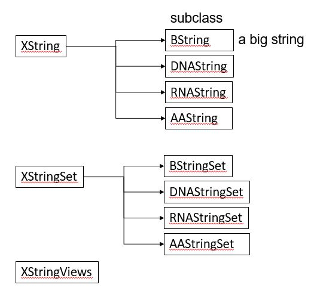

# Biostrings 

`Biostrings`는 아래와 같이 Bioconductor에서 제공하는 코드를 이용해서 설치할 수 있습니다.  
```{r eval=FALSE}
if (!requireNamespace("BiocManager", quietly = TRUE))
    install.packages("BiocManager")

BiocManager::install("Biostrings")
```

```{r, eval=F}
library(Biostrings)
```

Biostrings 패키지는 기본적으로 ```XString, XStringSet, XStringViews``` 3가지의 class를 정의하고 있습니다. XString은 DNA나 RNA, AA 등 생물학적 서열 한 가닥을 다루기위한 클래스이며 XStringSet은 여러 가닥을 다루기위한 클래스 입니다. 




다음 내장변수 들은 `Biostrings` 패키지를 로드하면 자동으로 저장되는 변수들로 생물학적 서열을 미리 정의해 놓았습니다. 

```{r, eval=F}
DNA_BASES
DNA_ALPHABET
IUPAC_CODE_MAP
```

위 변수들을 이용하면 다음처럼 `sample()` 함수를 이용해서 랜덤하게 DNA 서열을 얻을 수 있습니다. `DNA_BASES`가 4개 길이를 갖는 벡터인데 이 중 10개를 뽑으려면 `replace=T`로 해야 합니다. 

```{r, eval=F}
x0 <- sample(DNA_BASES, 10, replace = T)
x0
x1 <- paste(x0, collapse="")
x1
```

관련 함수는 [Cheat sheat](http://bioconductor.org/packages/release/bioc/vignettes/Biostrings/inst/doc/BiostringsQuickOverview.pdf) 참고

XString 클래스 특히 DNAString 클래스의 사용법은 다음 코드를 통해 익힐 수 있습니다. `length` 함수는 핵산의 갯수를 (`DNAStringSet` 타입의 변수에서 length는 DNA 가닥의 갯수이며 핵산의 갯수는 `nchar`함수로 얻어낼 수 있습니다. `toString`은 DNAString 타입을 단순 문자열로 변환해주는 함수이며 상보서열, 역상보서열 등의 정보도 `complement`, `reverseComplement` 등을 사용하여 찾아낼 수 있습니다. 


```{r eval=FALSE}
x0 <- paste(sample(DNA_BASES, 10, replace = T), collapse="")
x1 = DNAString(x0)
class(x0)
class(x1)
length(x1)
toString(x1)
complement(x1)
Biostrings::complement(x1)
reverseComplement(x1)
```

DNAString의 인덱싱은 vector (string)과 같으며 DNAStringSet은 list의 인덱싱과 같습니다. 

```{r, eval=FALSE}
## indexing
x1[1]
x1[1:3]
subseq(x1, start=3, end=5)
subseq(x1, 3, 5)

## letter frequency
alphabetFrequency(x1, baseOnly=TRUE, as.prob=TRUE)
letterFrequency(x1, c("G", "C"), as.prob=TRUE)

```


### Exercise {#ex03-1}

시작코돈과 종결코돈이 있는 길이 36bp 짜리 DNA (랜덤) 서열을 만들고 GC 비율을 계산하시오

```{r, eval=FALSE,  echo=F}
x0 <- paste(sample(DNA_BASES, 30, replace = T), collapse="")
x0
x1 <- paste("ATG", x0, "TAG", sep="")
x1
x1 <- DNAString(x1)
x1
class(x1)
complement(x1)
translate(x1)
```


`DNAStringSet` class는 여러개의 `DNAString` 을 모아 놓은 집합이라고 보면 됩니다. `length` 함수는 DNA string의 갯수이며 `width` 또는 `nchar` 함수로 각 string의 길이를 구할 수 있으며 이 외 대부분의 `DNAString` 에서 사용되는 함수가 동일하게 사용될 수 있습니다. 

```{r eval=FALSE}

x0 <- c("CTC-NACCAGTAT", "TTGA", "TACCTAGAG")
x1 <- DNAStringSet(x0)
class(x0)
class(x1)
names(x1)
names(x1) <- c("A", "B", "C")
length(x1)
width(x1)
subseq(x1, 2, 4)
x1[[1]]
x1[1]


x3 <- DNAString("ATGAGTAGTTAG")
x4 <- c(x1, DNAStringSet(x3))
x4[-1]
x4
alphabetFrequency(x1, baseOnly=TRUE, as.prob=TRUE)
letterFrequency(x1, c("G", "C"), as.prob=TRUE)
rowSums(letterFrequency(x1, c("G", "C"), as.prob=TRUE))
subseq(x4, 2, 4)
```


아래는 가장 직관적으로 생각할 수 있는 `for`를 이용한 방법입니다. 즉, 10개 저장소를 갖는 x0 변수를 미리 생성해 두고 for 문을 돌면서 서열을 하나씩 만들어 저장하는 방법입니다. 

```{r, eval=F}
x0 <- rep("", 10)
for(i in 1:length(x0)){
  tmp <- paste(sample(DNA_BASES, 30, replace = T), collapse="")
  x0[i] <- paste("ATG", tmp, "TAG", sep="")
}
x0
```


위 코드를 함수로 만들어 보겠습니다. random dna를 만들 때 길이만 다를뿐 같은 코드를 반복해서 사용하고 있습니다. 이럴 경우 DNA 길이를 사용자가 정해주도록 input parameter로 하고 해당 파라메터를 받아 DNA를 만들어 주는 함수를 만들어 사용하면 편리합니다. 

```{r, eval=F}
random_dna <- function(len){
  tmp <- paste(sample(DNA_BASES, len, replace = T), collapse="")
  x0 <- paste("ATG", tmp, "TAG", sep="")
  return(x0)
}
random_dna(len=30)
random_dna(len=40)
```

파라메터로 넘겨진 len 값이 sample 함수의 len에 사용된 것을 참고하세요. 


이제 길이 30bp짜리 10개의 서열을 반복해서 만들 때 위 함수를 앞서와 같이 for문을 이용하여 10번 반복해서 실행해 주면 같은 결과를 얻습니다. 위와 같이 함수를 만들어 두면 언제든 DNA 서열을 만들 때 재사용 할 수 있습니다.  

```{r, eval=F}
x0 <- rep("", 10)
for(i in 1:length(x0)){
  x0[i] <- random_dna(30)
}
x0
```

그런데 R에는 `apply` 와 같은 행렬연산 함수가 있어서 for문을 사용하지 않고 편리하게 반복문을 실행할 수 있습니다. `replicate` 함수는 `apply`와 같은 기능으로 list나 vector 변수에 대해서 사용할 수 있습니다. 즉, 다음과 같이 사용자가 원하는 함수를 반복해서 실행하고 반복 수 만큼의 길이를 갖는 결과를 반환합니다. 

```{r, eval=F}
x0 <- replicate(10, random_dna(30))
x0
x1 <- DNAStringSet(x0)
x1
```

위 x0 스트링들을 XStringSet으로 바꾸고 GC 비율을 구한 후  bargraph를 그리겠습니다. gc_ratio가 G와 C의 비율값을 저장한 10x2 테이블이므로 x축에 10개의 서열과 각 서열의 GC비율을 나타내고 y축에 비율 값을 그리는 것으로 생각한 후 ggplot의 aes와 파라메터를 적절히 지정해 줍니다.  

```{r, eval=F}
x1 <- DNAStringSet(x0)
gc_ratio1 <- letterFrequency(x1, c("G", "C"), as.prob=TRUE)
gc_ratio2 <- rowSums(gc_ratio1)
barplot(gc_ratio2, beside=T)

```


`Biostrings`의 또 다른 class인 `XStringView`는 `XString` class의 DNA서열을 사용자가 원하는대로 볼 수 있는 인터페이스를 제공합니다. 사용법은 다음과 같습니다.    

```{r eval=FALSE}
x2 <- x1[[1]]
Views(x2, start=1, width=20)
Views(x2, start=1, end=4)
Views(x2, start=c(1,3), end=4)
Views(x2, start=c(1,3,4), width=20)
Views(x2, start=c(1,3,4), width=20)
i <- Views(x2, start=c(1,3,4), width=20)
```

다음과 같이 한 서열에 대한 여러 부분의 서열 조각도 볼 수 있으며 `gaps` 함수는 매개변수로 주어진 서열 view의 구간을 제외한 나머지 구간의 서열을 보여주는 함수입니다. `successiveviews` 함수는 처음 서열부터 매개변수 width에 주어진 갯수 만큼의 서열을 보여주며 `rep()` 함수를 이용해서 서열의 처음부터 끝까지 보여주는 기능을 합니다. 

```{r eval=FALSE}
v <- Views(x2, start=c(1,10), end=c(3,15))
gaps(v)

successiveViews(x2, width=20)
successiveViews(x2, width=rep(20, 2))
successiveViews(x2, width=rep(20, 3))

```


## 서열 읽고 쓰기 


 
```{r, eval=F}
writeXStringSet(DNAStringSet(x0), "myfastaseq.fasta", format="fasta")

myseq <- readDNAStringSet("myfastaseq.fasta", format="fasta")
myseq
```


### Exercise {#ex03-2}

1000bp 길이의 랜덤 DNA 서열을 만들고 40bp 단위의 길이로 보는 코드를 만들어 보겠습니다. 앞서 만들어둔 `random_dna()` 함수를 사용하면 되며 `successiveview` 함수를 사용해야 하므로 `DNAString`으로 변환이 필요하며 서열의 길이에 따라서 `rep()` 를 이용하여 반복 횟수를 자동 계산합니다. 

```{r, eval=F, echo=F}
x0 <- random_dna(1000)
x1 <- DNAString(x0)
successiveViews(x1, width=rep(40, (nchar(x1)/40)+1))
```


```{r, eval=F}
proseq1 <- readDNAStringSet("sequences/MoClo_Plant_Parts_Kit_promoter.fasta")
proseq2 <- readDNAStringSet("sequences/MoClo_Plant_Parts_II_promoter.fasta")
proseq3 <- readDNAStringSet("sequences/RDA_promoter.fasta")
proseq <- c(proseq1, proseq2, proseq3)

termseq <- readDNAStringSet("sequences/MoClo_Plant_Parts_Kit_terminator.fasta")
tabaco <- readDNAStringSet("sequences/binary-cds.fasta")


```


## 대량 서열 비교 및 브라우징

```{r, eval=F}
dbConn <- dbConnect(SQLite(), ":memory:")
Seqs2DB(selseq, "XStringSet", dbConn, "syndna")
BrowseDB(dbConn)
BrowseSeqs(selseq)
myaln <- AlignSeqs(selseq)
BrowseSeqs(myaln)
```

각 DNA를 저장한 후 Dsembler 수행

```{r, eval=F}
writeXStringSet(selseq, "selected_comb_dnaseq_set.fasta")
```

  
[msa](https://bioconductor.org/packages/release/bioc/vignettes/msa/inst/doc/msa.pdf) 참고 alignment 


```{r, eval=F}
library(msa)

myseqs <- DNAStringSet(list(tmps1, tmps2))
myaln <- msa(myseqs)
print(myaln, show="complete")

#msaPrettyPrint(myaln, output="asis", showNames="none", showLogo="none", askForOverwrite=FALSE, verbose=FALSE)

colM <- IRanges(start=1, end=720)
colmask(myaln) <- colM
print(myaln, show="complete")


myconsmat <- consensusMatrix(myaln)
myconsmats <- msaConservationScore(myaln, BLOSUM62, gapVsGap=0, type="upperlower", thresh=c(40, 20))

myconsmat[,800:810]
mycons <- msaConsensusSequence(myaln, BLOSUM62, gapVsGap=0, type="upperlower", thresh=c(40,20))

data(BLOSUM62)


printSplitString <- function(x, width=getOption("width") - 1){
  starts <- seq(from=1, to=nchar(x), by=width)
  for (i in 1:length(starts))
  cat(substr(x, starts[i], starts[i] + width - 1), "\n")
}


printSplitString(mycons, width = 50)
```


## GenomicRanges


## Data structure and management for genome-scale experiments

연구를 수행하면서 잘못된 데이터 관리로 인한 손실을 줄이기 위해서는 고도로 효율적이고 신뢰성 높은 툴이 필요합니다. 일반적으로 사용되는 엑셀 기반의 데이터 관리는 신뢰성과 파이프라인 측면에서 적합하지 않습니다. 즉, 특정 파이프라인을 만들어 놓고 이에 따라서 일관적으로 데이터를 관리할 때 높은 신뢰성의 데이터를 확보할 수 있고 과학적 추론의 바탕이 될 수 있습니다. 따라서 복잡한 데이터의 구조를 체계적으로 정의하고 정형화된 도구들로 분석 파이프라인을 개발할 필요가 있습니다.   


## Working with objects

객체지향프로그래밍 (OOP)은 복잡한 문제를 프로그래밍할 때 발생되는 코드의 복잡성을 해결할 수 있는 하나의 방안으로 1990년대부터 많이 사용되었습니다. Genome 스케일의 experiment나 annotation은 대표적인 복잡한 데이터 중 하나 입니다. `bioconcuctor`는 OOP의 개념을 도입하여 이러한 생물학 데이터를 구조화하고 효율적으로 데이터를 관리하고 있습니다. 


Class와 Object, Instance 개념을 먼저 이해할 필요가 있습니다.  엄밀히 따지면 Object는 우리가 구현할 대상, Class는 설계도, Instance는 실제 구현한 대상 이라고 이해하시면 좋지만 가끔 Instance와 Object는 같은 의미로 사용되기도 합니다. 예를 들어 우리가 연구하는 `사람`, `원숭이`, `제브라피쉬` 라는 object들의 정보를 저장한다고 생각해 봅니다. 이 경우 각 객체들이 공통적으로 `name`, `age`, `genome` 등의 정보를 가지고 있고 그 기능적 특징 또한 유사하므로 이러한 정보가 저장되는 공간을 갖는 `생명체`라는 개념적 설계도를 (Class) 먼저 만듭니다. 그리고 해당 클래스의 *H.sapiens*, *D. rerio*, *B. Ape*, *C. goeldii* 를 만들면 각 객체의 구성 요소를 일일히 구현할 필요 없이 필요한 정보를 미리 정해진 구조에 맞게 저장 해주면 됩니다. 

> Bioconductor에서 OOP 개념은 다음과 같습니다.   
> class - 복잡한 데이터 구조의 틀  
> object - 특정 클래스가 특정 구현된 실례 (instance)  
> method - 특정 클래스의 구현된 기능 (get/set)  


그런데 이러한 class가 무수히 존재하며 각 name, age 등의 정보에 접근할 수 있는 method들을 제공하고 있습니다. class마다 사용 가능한 method가 어떠한 정보가 있는지 알기 위해서 `methods()`라는 함수를 사용합니다. 예를 들어 객체 `Homo.sapience`를 살펴보면 다음과 같습니다. 

```{r, eval=FALSE}
library(Homo.sapiens)
class(Homo.sapiens)
?OrganismDb
```

> The OrganismDb class is a container for storing knowledge about existing Annotation packages and the relationships between these resources.

```{r, eval=F}
methods(class=class(Homo.sapiens))
genes(Homo.sapiens)[1:10]
exons(Homo.sapiens)[1:10]
homo_seq <- seqinfo(Homo.sapiens)
class(homo_seq)
?Seqinfo
```

> A Seqinfo object is a table-like object that contains basic information about a set of genomic sequences. ...

```{r, eval=F}
length(homo_seq)
seqnames(homo_seq)
```

bioconductor에는 대용량 정보가 object 형태로 구조화되어 저장되어 있으며 `library()`함수로 읽어올 수 있고 다양한 함수로 해당 object의 정보를 읽어올 수 있습니다. 


### ExpressionSet Class

`Biobase` 패키지는 지놈 데이터를 관리하기 위한 표준화된 데이터 구조 class인 `ExpressionSet`를 제공합니다. 


```{r, eval=F}
library(Biobase)
?ExpressionSet

data(sample.ExpressionSet)
sample.ExpressionSet
#browseVignettes("Biobase")
#methods(class="ExpressionSet")
featureNames(sample.ExpressionSet)[1:5]
sampleNames(sample.ExpressionSet)[1:5]

expression_data <- exprs(sample.ExpressionSet)
dim(expression_data)
feature_data <- fData(sample.ExpressionSet)
dim(feature_data)
pheno_data <- pData(sample.ExpressionSet)
dim(pheno_data)
```


급성 림프구성 백혈병 데이터 
```{r, eval=F}
library(ALL)
data(ALL)
class(ALL)
ALL
browseVignettes("ALL")
#methods(class=class(ALL))
pData(ALL)
pData(ALL)$age
fData(ALL)
## 
phenoData(ALL)
varMetadata(phenoData(ALL))
featureData(ALL)
```

메타데이터는 데이터(data)에 대한 데이터로서 일반적으로는 어떤 목적을 가지고 만들어진 데이터로 정의됩니다. 


Gene expression omnibus (GEO)
GEO는 microarray, next-generation sequencing 등의 high-throughput 유전체 데이터를 보유한 공공 저장소입니다. 

* 대규모 기능유전체 데이터베이스 
* 데이터 기탁 쉽게 만들고 고수준 QC 유지
* 사용하기 쉬운 인터페이스 유지


[GEO](https://www.ncbi.nlm.nih.gov/geo/info/overview.html)


<!-- [GEO accession data GSE62944](https://www.bioconductor.org/packages/release/data/experiment/html/GSE62944.html) 설명  -->

<!-- ```{r, eval=F} -->

<!-- if (!requireNamespace("BiocManager", quietly = TRUE)) -->
<!--     install.packages("BiocManager") -->

<!-- BiocManager::install("GSE62944") -->
<!-- library(GSE62944) -->
<!-- browseVignettes("GSE62944") -->

<!-- BiocManager::install("ExperimentHub") -->
<!-- browseVignettes("ExperimentHub") -->
<!-- library(ExperimentHub) -->

<!-- eh = ExperimentHub(localHub=FALSE) -->

<!-- query(eh, "GSE62944") -->
<!-- tcga_data <- eh[["EH1043"]] -->

<!-- ``` -->


```{r, eval=F}
library(GEOquery)
browseVignettes("GEOquery")
```

The `GDS` class
```{r, eval=F}
gds <- getGEO(filename=system.file("extdata/GDS507.soft.gz",package="GEOquery"))
class(gds)
methods(class=class(gds))
Table(gds)
dataTable(gds)
show(gds)
Columns(gds)
```

The `GSM` class
```{r, eval=F}
gsm <- getGEO(filename=system.file("extdata/GSM11805.txt.gz",package="GEOquery"))
methods(class=class(gsm))
head(Meta(gsm))
Table(gsm)[1:5,]
dim(Table(gsm))
Columns(gsm)

```

The `GSE` class
```{r, eval=F}
gse <- getGEO(filename=system.file("extdata/GSE781_family.soft.gz",package="GEOquery"))
methods(class=class(gse))
head(Meta(gse))
names(GSMList(gse))
class(GSMList(gse)[[1]])
```

ExpressionSet class의 GES 데이터 받기 [GSE2553](https://www.ncbi.nlm.nih.gov/geo/query/acc.cgi?acc=GSE2553) 

```{r, eval=F}
gse2553 <- getGEO('GSE2553',GSEMatrix=TRUE)
gse2553
class(gse2553)
class(gse2553[[1]])
mygse <- gse2553[[1]]
pData(mygse)[1:10,1:3]
```

GDS 데이터를 ExpressionSet class로 변환하기 
```{r, eval=F}
gds <- getGEO(filename=system.file("extdata/GDS507.soft.gz",package="GEOquery"))
class(gds)
eset <- GDS2eSet(gds, do.log2=TRUE)
eset

## boxplot/vioplot for the 17 samples
```


급성 림프구성 백혈병 데이터 (Annotation)
```{r, eval=F}
library(ALL)
data(ALL)
ALL
featureData(ALL)

## 
if (!requireNamespace("BiocManager", quietly = TRUE))
    install.packages("BiocManager")
BiocManager::install("hgu95av2.db")
library(hgu95av2.db)

browseVignettes("hgu95av2.db")
help(package="hgu95av2.db")

featureNames(ALL)[1:10]
ids <- featureNames(ALL)[1:10]
as.list(hgu95av2ENTREZID[ids])

```


## Download sequence information from NCBI

전세계 연구자들이 서열 데이터를 분석하는데 가장 많이 이용하는 사이트 중 하나가 NCBI 이며 따라서 NCBI에서는 연구자들이 데이터베이스에 접근하기위한 편리한 방법을 제공하고 있고 그 중 하나가 Entrez 입니다. 

R에서도 Entrez 기능을 도입한 package들이 제공되고 있으며 그 중 하나가 `rentrez` 입니다. https://www.ncbi.nlm.nih.gov/books/NBK25500/ 이 곳의 Downloading Full Records 를 참고하시면 좋습니다. Entrez는 대략적으로 다음 9개의 유틸리티를 제공합니다. 


> EInfo (database statistics)  
> ESearch (text searches)  
> EPost (UID uploads)  
> ESummary (document summary downloads)  
> EFetch (data record downloads)  
> ELink (Entrez links)  
> EGQuery (global query)  
> ESpell (spelling suggestions)  
> ECitMatch (batch citation searching in PubMed)  

이 중 `ESerach`, `EPost`, `ESummary`, `EFetch` 등이 많이 사용하는 유틸이며 정보를 다운로드 받을 경우는 `EFetch` 를 주로 사용하게 됩니다. 예제로 뎅기바이러스 서열 4종을 다운로드 하겠습니다. NCBI의 accession 번호를 알 경우이며 각각에 대한 accession no.는 NC_001477, NC_001474, NC_001475 and NC_002640 입니다. 

```{r, eval=FALSE}
library(rentrez)
entrez_dbs()
entrez_db_summary("nuccore")

##
acc <- c("NC_001477", "NC_001474", "NC_001475", "NC_002640")
all_recs <- entrez_fetch(db="nuccore", id=acc[1], rettype="fasta")
cat(strwrap(substr(all_recs, 1, 500)), sep="\n")
write(all_recs, file="myseq.fasta")
dang <- readDNAStringSet("myseq.fasta", format="fasta")

##
r_search <- entrez_search(db="pubmed", term="R Language")
all_recs <- entrez_fetch(db="pubmed", id=r_search$ids, rettype="fasta")
write(all_recs, file="mypub.txt")

```


---


<a rel="license" href="http://creativecommons.org/licenses/by-nc-nd/4.0/"></a><br />이 저작물은 <a rel="license" href="http://creativecommons.org/licenses/by-nc-nd/4.0/">크리에이티브 커먼즈 저작자표시-비영리-변경금지 4.0 국제 라이선스</a>에 따라 이용할 수 있습니다.
